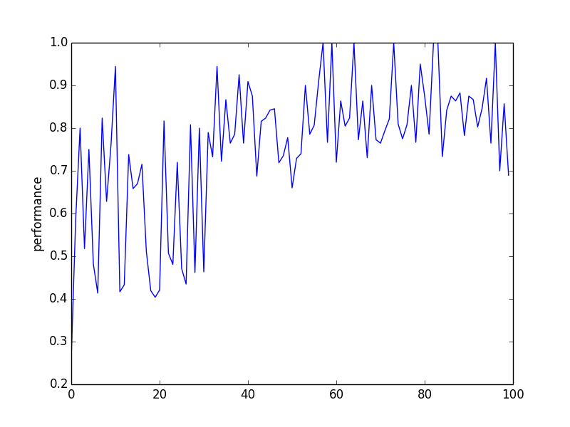

# P4: Train a Smart Cab to Drive

## Implement a basic driving agent

Our first policy was to choose a random move/action from `(None, 'forward', 'left', 'right')`.
Then we ran this agent within the simulation environment with `enforce_deadline` set to `False`.

*In your report, mention what you see in the agent’s behavior. Does it eventually make it to the target location?*

The agent moves randomly.  If I waited long enough, it would probably eventually make it to the target location, but
I never saw it do so.

## Identify and update state

*Justify why you picked these set of states, and how they model the agent and its environment.*

I first picked the following states:

* left
* right
* oncoming
* light

These four states seemed like a good start as they give enough information that the smart cab
can go through intersections without breaking any traffic laws.  

## Implement Q-Learning

Using 
the Udacity Reinforcement Learning lectures as a reference, I implemented Q-learning.  At this point, I also added
one more item to the agent's state:

* next_waypoint

Adding this state allows the smart cab to make progress towards the goal.  My agent seemed a bit more purposeful at this point.  It did reach the goal several times (with `enforce_deadline` still set to `False`) as I watched it.

At this point, I decided to start recording the exact results.  I now had the following settings:

* state: left, right, oncoming, light, next_waypoint
* discount (gamma): 0.9
* step size (alpha): 0.2

Here is the abridged output running with those settings:

	Simulator.run(): Trial 0
	Environment.reset(): Trial set up with start = (8, 3), destination = (2, 6), deadline = 45
	Environment.reset(): Primary agent could not reach destination within deadline!

	Simulator.run(): Trial 1
	Environment.reset(): Trial set up with start = (5, 6), destination = (2, 3), deadline = 30
	Environment.act(): Primary agent has reached destination!
	LearningAgent.update(): deadline = 6, inputs = {'light': 'green', 'oncoming': None, 'right': None, 'left': None}, action = forward, reward = 12

	Simulator.run(): Trial 2
	Environment.reset(): Trial set up with start = (5, 5), destination = (2, 6), deadline = 20
	Environment.act(): Primary agent has reached destination!
	LearningAgent.update(): deadline = 7, inputs = {'light': 'green', 'oncoming': None, 'right': None, 'left': None}, action = forward, reward = 10.5

	Simulator.run(): Trial 3
	Environment.reset(): Trial set up with start = (7, 1), destination = (4, 4), deadline = 30
	Environment.reset(): Primary agent could not reach destination within deadline!

	Simulator.run(): Trial 4
	Environment.reset(): Trial set up with start = (3, 4), destination = (5, 2), deadline = 20
	Environment.reset(): Primary agent could not reach destination within deadline!

	Simulator.run(): Trial 5
	Environment.reset(): Trial set up with start = (7, 6), destination = (3, 4), deadline = 30
	Environment.reset(): Primary agent could not reach destination within deadline!

	Simulator.run(): Trial 6
	Environment.reset(): Trial set up with start = (4, 1), destination = (4, 6), deadline = 25
	Environment.act(): Primary agent has reached destination!
	LearningAgent.update(): deadline = 21, inputs = {'light': 'green', 'oncoming': None, 'right': None, 'left': None}, action = forward, reward = 12

	Simulator.run(): Trial 7
	Environment.reset(): Trial set up with start = (6, 3), destination = (4, 5), deadline = 20
	Environment.act(): Primary agent has reached destination!
	LearningAgent.update(): deadline = 3, inputs = {'light': 'red', 'oncoming': None, 'right': None, 'left': None}, action = right, reward = 12

	Simulator.run(): Trial 8
	Environment.reset(): Trial set up with start = (6, 2), destination = (8, 6), deadline = 30
	Environment.act(): Primary agent has reached destination!
	LearningAgent.update(): deadline = 13, inputs = {'light': 'red', 'oncoming': None, 'right': None, 'left': None}, action = right, reward = 12

	Simulator.run(): Trial 9
	Environment.reset(): Trial set up with start = (8, 2), destination = (1, 3), deadline = 40
	Environment.act(): Primary agent has reached destination!
	LearningAgent.update(): deadline = 2, inputs = {'light': 'red', 'oncoming': None, 'right': None, 'left': None}, action = right, reward = 12

As we can see, the agent reached the primary destination 6 out of 10 times.  Moreover, at least in the cases where the destination was reached, the reward was always positive.

## Enhance the driving agent

*Report what changes you made to your basic implementation of Q-Learning to achieve the final version of the agent. How well does it perform?*

I considered a trial to have succeeded if it reached
the destination and the cumulative reward was non-negative.

It took a lot of work on my implementation before I achieved good results.  Without really thinking much about it,
I first used a greedy policy for choosing the next action.  I fiddled around with the value of gamma quite a lot, but could
not do better than a success rate of about 40% (I must have gotten lucky with that first run success
rate of 60%). 

(Incidentally, at this point I needed to create some automation to summarize my results.  With 100 trials,
I could no longer count the success rate manually every time.  My automation is in 
[analyze_data.py](../smartcab/analyze_data.py).  It simply parses the output, which I would redirect to a file,
and then creates a [spreadsheet](../data/result.csv).)

After spending many hours doing this, I finally went back and listened
to the lectures again (always running experiments in the background).  Watching the lectures again was not a bad idea.  Using the ideas in the lecture, I implemented an epsilon-greedy strategy.  Although I'm sure this probably improved things, it was not evident
for 100 trials.  I next tried an epsilon-decreasing strategy.  Again, this did not seem to help (at least with 100 trials).

Finally, I tried adding "optimism in the face of uncertainty" initialization of the Q table.  This made all the difference in the world.  I was now achieving success rates of 80% and higher.

To achieve the final version of the agent, I experimented with different values of gamma.  I recorded
the results in this [spreadsheet](../data/performance.csv).  

With gamma set to 0.900, I achieved a success rate of 97%.

*Does your agent get close to finding an optimal policy, i.e. reach the destination in the minimum possible time, and not incur any penalties?*

I measured how close I was to finding an optimal policy by dividing the total rewards accrued during a trial by the maximum 
possible total rewards possible during that trial.  You can see convergence towards an optimal policy in this plot:

There is some fluctuation from trial to trial, but you can see that our policy converged to a value that was about 0.8 the value of the optimal policy.
