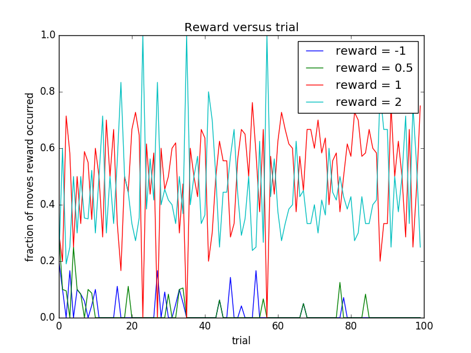

# P4: Train a Smart Cab to Drive

## Implement a basic driving agent

Our first policy was to choose a random move/action from `(None, 'forward', 'left', 'right')`.
Then we ran this agent within the simulation environment with `enforce_deadline` set to `False`.

*In your report, mention what you see in the agent’s behavior. Does it eventually make it to the target location?*

The agent moves randomly.  If I waited long enough, it would probably eventually make it to the target location, but
I never saw it do so.

## Identify and update state

*Justify why you picked these set of states, and how they model the agent and its environment.*

I picked the following states:

* left
* right
* oncoming
* light
* next_waypoint

The first four states seemed like a good start as they give enough information that the smart cab
can go through intersections without breaking any traffic laws.  Of course, the cab must know whether 
it has a green or red light.  If the light is green, the cab can freely go straight through the intersection
or make a right turn.  However, if it wants to make a left turn on green, it needs to know the state of any on-coming
cars.  If the light is red, the cab can make a right turn, if it will not interfere with cars on the left, on the right,
and on-coming cars.  Thus, we need each of these four states for the cab to learn to obey all traffic laws.

Adding the next_waypoint state allows the smart cab to make progress towards the destination.  

## Implement Q-Learning

Using 
the Udacity Reinforcement Learning lectures as a reference, I implemented Q-learning.  

My agent seemed a bit more purposeful at this point.  It did reach the goal several times (with `enforce_deadline` still set to `False`) as I watched it.

At this point, I decided to start recording the exact results.  I now had the following settings:

* state: left, right, oncoming, light, next_waypoint
* discount (gamma): 0.9
* step size (alpha): 0.2

With these settings, the agent reached the primary destination 6 out of 10 times.  Moreover, at least in the cases where the destination was reached, the cumulative reward was always positive.

By looking at the plot below, we can see the changes in behavior as the smart cab learned.

After the 80th trial, the cab stopped getting negative rewards.  In other words, it stopped making illegal
moves.  And after about the 85th trial, it received rewards of only 1 or 2 and no rewards of 0.5 (or -1).  In other words,
it always moved when legal, and, when it did move, it moved to the next way-point.  So it was driving optimally after
the 85th trial.

## Enhance the driving agent

*Report what changes you made to your basic implementation of Q-Learning to achieve the final version of the agent. How well does it perform?*

I considered a trial to have succeeded if it reached
the destination and the cumulative reward was non-negative.

It took a lot of work on my implementation before I achieved good results.  Without really thinking much about it,
I first used a greedy policy for choosing the next action.  I fiddled around with the value of gamma quite a lot, but could
not do better than a success rate of about 40% (I must have gotten lucky with that first run success
rate of 60%). 

(Incidentally, at this point I needed to create some automation to summarize my results.  With 100 trials,
I could no longer count the success rate manually every time.  My automation is in 
[analyze_data.py](https://github.com/paul-reiners/smartcab/blob/master/smartcab/analyze_data.py).  It simply parses the output, which I would redirect to a file,
and then creates a [spreadsheet](https://github.com/paul-reiners/smartcab/blob/master/data/result.csv).)

After spending many hours doing this, I finally went back and listened
to the lectures again (always running experiments in the background).  Watching the lectures again was not a bad idea.  Using the ideas in the lecture, I implemented an epsilon-greedy strategy.  Although I'm sure this probably improved things, it was not evident
for 100 trials.  I next tried an epsilon-decreasing strategy.  Again, this did not seem to help (at least with 100 trials).

Finally, I tried adding ["optimism in the face of uncertainty"](https://youtu.be/ws5BOy6L_V0?t=1m37s) initialization of the Q table.  From
the class lecture:

> [O]ne way to
> achieve this exploration-exploitation balance, was to
> randomly choose actions. So to change
> the [way] we're doing action selection. But there's another one too, which is that
> we can actually by manipulating the initialization of the Q function. We can
> actually get another kind of exploration, can you see how that might work?
>
> Oh, I know what you do. If you could, if
> you set, say the Q values to all be the highest
> possible value they could be.
>
> Great, so if we initialized the Q hat to awesome values, then what the
> Q learning algorithm would do, even with
> greedy exploration, what it will do is it
> will try things that it hasn't tried very much, and it still thinks are awesome.
> And little by little, it gets a more
> realistic sense of how the environment works.
> 
> So it's very optimistic?
>
> That's right, exactly and it's referred to often as "optimism in the face of uncertainty" 
> and it's a similar kind of idea that's
> used in algorithms like, A*, if you're familiar with search algorithms in AI.
>
> Oh yes, I remember those.
> 
> But this is, this is a really powerful idea and it's
> used in, in reinforcement learning and
banded algorithms and planning and search.
>
> Okay, and that makes sense because if
> everything is awesome. Then your true key value
> can only go down if awesome is bigger
> than the biggest Q value you could ever have.

Now, I didn't initialize with the biggest Q value you could have, but I picked 10.0 because
that is the large reward the cab gets upon reaching the goal.  Moreover, it increased the 
success rate from about 40% to above 80%.

To achieve the final version of the agent, I experimented with different values of gamma.  I recorded
the results in this [spreadsheet](https://github.com/paul-reiners/smartcab/blob/master/data/performance.csv).  

With gamma set to 0.900, I achieved a success rate of 97%.

*Does your agent get close to finding an optimal policy, i.e. reach the destination in the minimum possible time, and not incur any penalties?*

It's hard to calculate the optimal policy.  A move that seems optimal at the time might cause unforeseeable delays later depending on
the unpredictable behavior of other cars.  Nevertheless, since you can't predict the behavior of other agents, you can reasonably define the optimal policy to be to always go to the next way-point, while, when necessary, waiting for lights and traffic so as to not incur
any penalties.  As we saw earlier, our cab has learned the first type of optimal policy after 85 trials.
